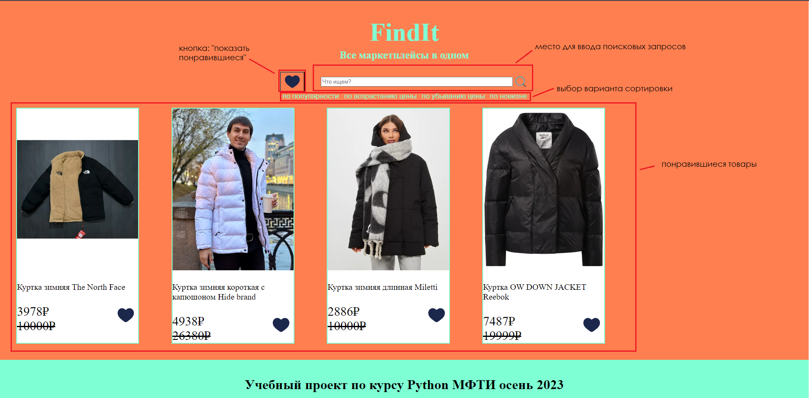

# FindIt
Сайт для поиска товаров с Ozon, Wildberries и Яндекс.Маркет.
# Установка:
1. git clone https://github.com/SharovSa/FindIt.git
2. git switch features
3. cd FindIt
4. ./build.sh
# Инструкция:
- Сайт работает по адресу: http://127.0.0.1:5000/
- Для настройки количества выводимых товаров с каждого маркетплейса откройте файл src/stuff.py и измените значение переменной COUNT_SEARCHED_PRODUCTS
- Так выглядит главная странница: 
- У карточек товаров есть область с сердечком. Если оно закрашено, то это значит, что товар находится в списке понравившихся вам товаров. Товар можно добавить в понравившиеся, нажав на незакрашенное сердечко, а нажав на закрашенное - убрать.
- Нажав на изображение товара в его карточке, вы перейдете на сайт, где этот товар был найден и где вы можете его заказать.
- Не делайте много одинаковых запросов, иначе ip могут заблокировать на Ozon или Яндекс.Маркет.
- Для завершения работы, нажмите сочетание клавиш Ctrl+C ( Ctrl + Z на Linux), а после введите в терминал команду docker-compose down, чтобы выключить контейнеры.
- Для ускорения работы поиска можно убрать OzonSearch и YaMarkerSearch из 22 строки файла src/sorter.py .
